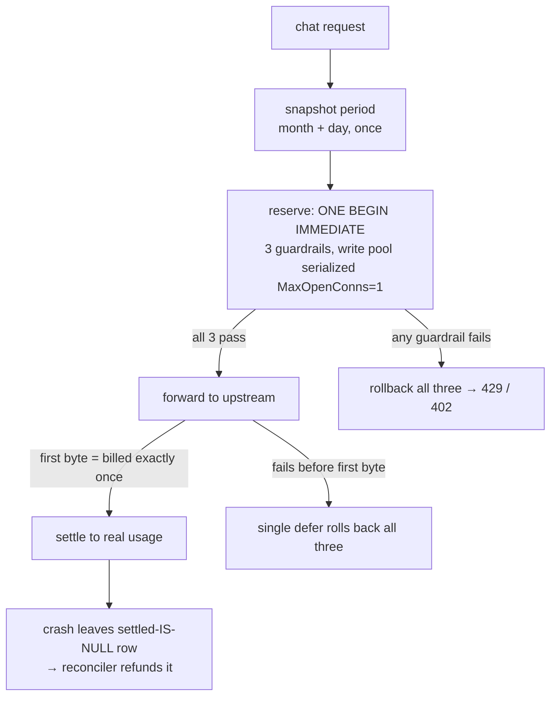
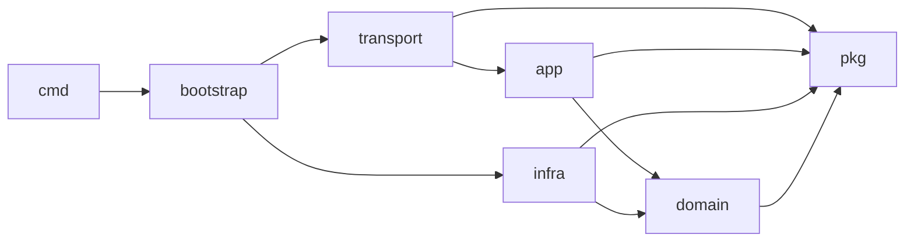

# Anselm Gateway

English · [简体中文](README.zh-CN.md)

[](https://github.com/Cookiezisg/Anselm-API-Serve/actions/workflows/ci.yml)


> **Never oversell your LLM budget.** A single-binary Go + SQLite gateway that puts a free, metered LLM tier in front of your app — your provider API key stays server-side, and a pessimistic three-gate reservation ledger means a crash can only ever *over-refund*, never over-sell.

Anselm Gateway is a thin, OpenAI-compatible proxy in front of one upstream (DeepSeek). It does three things, each to accounting-grade rigor:

1. **Proxies inference** — OpenAI-compatible `/v1/chat/completions` (streaming + non-streaming + `tools`/agentic). The upstream key is injected on a request *clone* and never leaves the server.
2. **Meters spend pessimistically** — before any upstream call it atomically reserves against three guardrails (monthly request count / per-install daily token cap / global daily budget) in a single SQLite transaction, then settles against real usage. Any failure rolls back; a crash only ever over-charges, never under-charges. The operator's wallet is never oversold.
3. **Resists abuse** — anonymous install tokens (stored only as SHA-256) plus optional Proof-of-Work / rate-limit gates (all dormant by default).

The clean architecture is **enforced by the linter** (golangci-lint depguard), there's an invariants registry used as acceptance criteria, 11 immutable ADRs, tests across all four layers plus a real loopback end-to-end suite, and a deploy with readyz-gated auto-rollback.

## The never-oversell ledger



The three guardrails — `monthly count < quota`, `install daily tokens + estimate ≤ cap`, `global daily budget + estimate ≤ budget` — are checked in **one** `BEGIN IMMEDIATE` transaction on a single-writer pool, so concurrent requests can't race the read-modify-write. Billing happens once, at the upstream's first byte. Anything that fails *before* the first byte reverses all three reservations through a single defensive defer. A crash can only leave a request **over**-charged (a `settled IS NULL` row the reconciler refunds), never under-charged. Most LLM gateways hand-wave this; here it's the core design.

## Architecture (clean, and enforced)



Dependencies point only inward toward more stable layers, and **the build fails on a violation** (depguard): `domain` has zero infra imports, `app` declares the infra ports it needs as interfaces, `*sql.Tx` never leaks out of `infra`, and `bootstrap` is the only package allowed to import across layers — nothing imports it. Three physically isolated listeners: a public business API, a loopback-only admin/metrics/pprof surface, and a loopback ops dashboard.

## Why it might be worth a look

- **Accounting you can trust** — single-writer SQLite + `BEGIN IMMEDIATE`, reserve → forward → settle saga, `settled IS NULL` single-winner CAS idempotency, crash-only-overcharges reconciliation.
- **Clean architecture that's actually enforced** — the import graph is a CI gate, not a wiki diagram.
- **An invariants registry + 11 ADRs** — `GW-INV-NN` rules used as per-change acceptance criteria; 14 known bug classes made structurally impossible (e.g. breaker DoS-amplification excluded by fault classification, ADR-011).
- **One static binary** — pure Go (`CGO_ENABLED=0`) + embedded SQLite (WAL) + a React/Vite ops dashboard `go:embed`'d into the binary, so deploying needs no Node toolchain.
- **Agentic free tier** — passes `tools`/`tool_choice` through and preserves `reasoning_content` across multi-turn tool calls.
- **Production CI/CD** — race tests, golangci-lint, govulncheck, fuzz smoke, SPDX SBOM, a frontend drift gate (rebuild the embedded dashboard and `git diff --exit-code`), SHA-pinned actions, readyz-gated auto-rollback, systemd socket-activation for zero-dropped-connections on restart.

## Quickstart

```sh
cp .env.example .env          # set at least DEEPSEEK_API_KEY
set -a; source .env; set +a   # (bash/zsh; fish: see .env.example)
make run                      # = go run ./cmd/gateway
curl -s localhost:8080/healthz   # → {"status":"ok"}
```

End to end (claim a token, then use it like any OpenAI-compatible endpoint):

```sh
TOKEN=$(curl -s -XPOST localhost:8080/v1/install | jq -r .token)

curl -s localhost:8080/v1/chat/completions \
  -H "Authorization: Bearer $TOKEN" -H 'Content-Type: application/json' \
  -d '{"model":"deepseek-chat","stream":true,
       "messages":[{"role":"user","content":"hello"}]}'

curl -s localhost:8080/v1/quota -H "Authorization: Bearer $TOKEN" | jq
```

`model` is force-rewritten to the first entry of `MODEL_ALLOWLIST`, so clients can send any model name; `GET /v1/models` returns the real list.

## Dashboard

The embedded React SPA — live overview, hot config editing, install ban / audit, one-click DB export — served from the binary behind session + CSRF auth (loopback, started only when `DASHBOARD_USER`/`DASHBOARD_PASSWORD` are set).

<!-- Add a screenshot at docs/assets/dashboard.png and uncomment: -->
<!--  -->

## API

Business surface (`127.0.0.1:8080`, public behind Caddy):

| Method | Path | Auth | Purpose |
|---|---|---|---|
| `POST` | `/v1/install` | none | Issue an install token (`{token, monthlyQuota, resetAt}`); shown once |
| `POST` | `/v1/chat/completions` | Bearer token | OpenAI-compatible inference; SSE or JSON per `stream` |
| `GET` | `/v1/models` | Bearer token | OpenAI `{object:"list", data:[…]}` from the live allowlist; read-only |
| `GET` | `/v1/quota` | Bearer token | `{limit, used, remaining, resetAt, available}` |
| `GET` | `/healthz` | none | Pure process liveness; never touches DB/upstream |

Admin (`127.0.0.1:9090`, **loopback-only**, never proxied): `/metrics`, `/readyz` (`{db, upstream, disk}`), `/debug/pprof/*`, `/debug/vars`.
Dashboard (`127.0.0.1:8081`, loopback): `/login`, `/logout`, and session-protected `/api/*`.

Responses are **bare entities** on success and `{"error":{"code","message"}}` on failure; the upstream body/key is never passed through. Full contract: [`docs/references/backend/api.md`](docs/references/backend/api.md).

## Configuration

Loading order is env defaults ← `settings`-table DB overlay (runtime-editable knobs hot-reload from the dashboard). Full surface: [`.env.example`](.env.example) and [`docs/references/backend/config.md`](docs/references/backend/config.md).

Secrets are **env-only** and never persisted, dumped, or logged: `DEEPSEEK_API_KEY` (required, comma-separated multi-key), `DASHBOARD_USER`/`DASHBOARD_PASSWORD` (paired, optional), `INSTALL_POW_SECRET` (required only if PoW is activated). Key guardrails: `GLOBAL_DAILY_BUDGET_TOKENS`, `INSTALL_DAILY_TOKEN_CAP` (must be ≤ the global budget), `MONTHLY_QUOTA`, `MAX_TOKENS_CAP` / `INPUT_TOKEN_CAP`, `N_GLOBAL_CONCURRENCY`, `RATE_PER_MIN`. Anti-abuse gates (`INSTALL_GLOBAL_DAILY_CAP`, `TOKEN_ANOMALY_RPM`, `INSTALL_POW_MODE`, …) all ship `0`/`off`.

## Deployment

Caddy + systemd on any VPS:

- Caddy terminates TLS and reverse-proxies `<your-domain> → 127.0.0.1:8080` (SSE flushed); the Go process binds `127.0.0.1` only and never faces the public internet directly.
- systemd socket-activation holds the `:8080` fd so connections survive a restart.
- GitHub Actions on push to `main`: `vet + test -race` → static `linux/amd64` build → versioned binary + atomic symlink → deploy gate (loopback `readyz`/`healthz`, auto-rollback to the previous version on failure) → keep the last 5.

Deployment target (domain, ACME email) is injected from GitHub secrets, not committed. See [`.github/workflows/deploy.yml`](.github/workflows/deploy.yml) and [`deploy/`](deploy/).

## Development

```sh
make verify    # vet + build + test -race + docs (local gate)
make lint      # golangci-lint v2.6.1 (incl. depguard layering gate)
make docs      # documentation governance gate
```

Tests cover all four layers (~48 `_test.go`) plus a loopback full-stack e2e (`internal/e2e`, `integration` tag); CI enforces coverage floors on the money paths (`app/quota` ≥ 70%, `app/chat` ≥ 65%) and runs govulncheck, gofmt, fuzz smoke, an SBOM, and a frontend-drift gate.

## Project status & scope

Live in production on `main`; the dashboard SPA is wired and served; single-turn and multi-turn agentic are verified end to end.

This is a **thin gateway**, deliberately: one upstream (DeepSeek), one operator's budget, a single-node SQLite database with a single-writer pool (the foundation of the atomic accounting — not a TODO). It's built for one product, but the patterns — the never-oversell reservation ledger and the enforced clean-architecture import graph — are designed to be lifted into your own gateway. It is not a multi-tenant LLM router, not a billing system, and not horizontally scalable; the admin surface is loopback-only by design.

## Documentation

`docs/` is a governed documentation system; the entry point is [`docs/INDEX.md`](docs/INDEX.md):

- [`concepts/architecture.md`](docs/concepts/architecture.md) — the system mental model
- [`references/backend/`](docs/references/backend/) — line-by-line contracts (api / config / database / error-codes / invariants)
- [`decisions/`](docs/decisions/) — ADR-001..011 (immutable rationale)

## License

[MIT](LICENSE).
