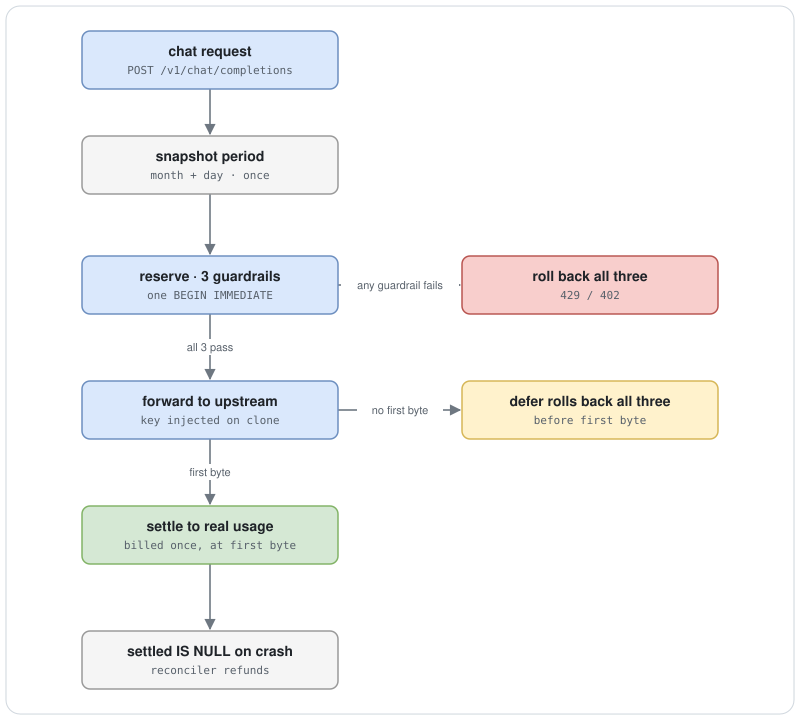
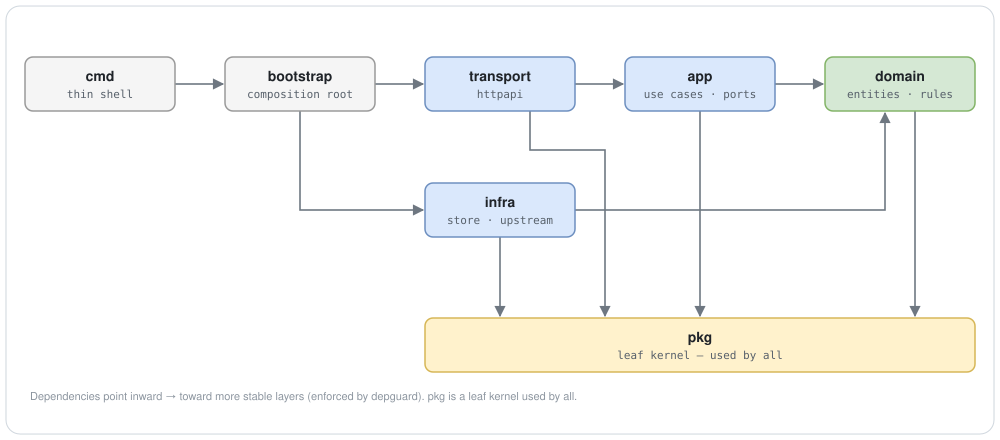

# Anselm Gateway

[English](README.md) · 简体中文

一个纯 Go + SQLite 的单二进制网关,把单个 LLM 上游(DeepSeek)包在 OpenAI 兼容的接口后面。上游 API key 只留在服务端;用量用悲观配额记账来计量,使 operator 的预算不会被超卖。它是为 Anselm 桌面 app 写的,但本身自包含。

它做三件事:

1. **代理** —— OpenAI 兼容的 `/v1/chat/completions`(流式与非流式,透传 `tools`/`tool_choice` 以支持多轮工具调用)。上游 key 注入在请求副本上,不会返回给客户端。
2. **计量** —— 进上游前,在单个 SQLite 事务里对三道闸(月度请求数 / 单 install 日 token 上限 / 全局日预算)预占,再据真实用量结算。失败回滚;崩溃只会多扣,不会少扣。
3. **限流** —— 匿名 install token(只存 SHA-256),外加默认关闭的 Proof-of-Work 与限流闸。

代码采用 Clean Architecture(domain / app / infra / transport,加一个 bootstrap 组合根),依赖方向由 golangci-lint(depguard)强制。四层都有测试,另有一个 loopback 全栈端到端套件;CI 跑 race 测试、lint、govulncheck、gofmt,以及一项"内嵌后台的构建是否与源一致"的检查。

## 配额记账



三道闸 —— `月度次数 < 配额`、`install 日 token + 估算 ≤ 上限`、`全局日预算 + 估算 ≤ 预算` —— 在同一个 `BEGIN IMMEDIATE` 事务、单写连接池里判定,因此并发请求不会竞争这次读-改-写。计费只发生一次,在上游首字节。首字节之前的任何失败,都通过一个 defer 回滚全部三项预占。崩溃会留下一行 `settled IS NULL`,由 reconciler 退还,所以失败模式是多扣、不是少扣。

## 架构



依赖只指向更稳定的内层,违反即构建失败(depguard):`domain` 无 infra import;`app` 在本包以 interface 声明所需 infra 端口;`*sql.Tx` 不漏出 `infra`;`bootstrap` 是唯一跨层 import 的包(它无人 import)。三个独立监听器:公网业务面、loopback-only 的运维/metrics/pprof 面、loopback 管理后台。

## 快速开始

```sh
cp .env.example .env          # 至少填 DEEPSEEK_API_KEY
set -a; source .env; set +a   # (bash/zsh;fish 见 .env.example)
make run                      # = go run ./cmd/gateway
curl -s localhost:8080/healthz   # → {"status":"ok"}
```

端到端(领号,然后当成任意 OpenAI 兼容端点用):

```sh
TOKEN=$(curl -s -XPOST localhost:8080/v1/install | jq -r .token)

curl -s localhost:8080/v1/chat/completions \
  -H "Authorization: Bearer $TOKEN" -H 'Content-Type: application/json' \
  -d '{"model":"deepseek-chat","stream":true,
       "messages":[{"role":"user","content":"hello"}]}'

curl -s localhost:8080/v1/quota -H "Authorization: Bearer $TOKEN" | jq
```

`model` 会被改写到 `MODEL_ALLOWLIST` 首项,客户端填任意 model 名都行;`GET /v1/models` 返回实际清单。

## 管理后台

内嵌的 React SPA(总览、配置编辑、install 封禁/审计、DB 导出),由二进制提供,在一个 loopback 端口上经会话 + CSRF 鉴权。仅当 `DASHBOARD_USER` 和 `DASHBOARD_PASSWORD` 都配置时才启动,且**不对公网暴露** —— 运维经 SSH 隧道访问:

```sh
ssh -L 8081:127.0.0.1:8081 <user>@<server>   # 然后浏览器开 http://localhost:8081
```

<!-- 把截图放到 docs/assets/dashboard.png 后取消注释: -->
<!--  -->

## API

业务面(`127.0.0.1:8080`,经 Caddy 暴露公网):

| 方法 | 路径 | 鉴权 | 说明 |
|---|---|---|---|
| `POST` | `/v1/install` | 无 | 领 install token(`{token, monthlyQuota, resetAt}`),只回显一次 |
| `POST` | `/v1/chat/completions` | Bearer token | OpenAI 兼容推理;按 `stream` 返 SSE 或 JSON |
| `GET` | `/v1/models` | Bearer token | OpenAI `{object:"list", data:[…]}`,源自实时 allowlist,只读 |
| `GET` | `/v1/quota` | Bearer token | `{limit, used, remaining, resetAt, available}` |
| `GET` | `/healthz` | 无 | 进程存活,不碰 DB / 上游 |

运维面(`127.0.0.1:9090`,loopback-only,不反代):`/metrics`、`/readyz`(`{db, upstream, disk}`)、`/debug/pprof/*`、`/debug/vars`。
管理后台(`127.0.0.1:8081`,loopback):`/login`、`/logout`,以及会话保护的 `/api/*`。

成功返回裸实体,失败返回 `{"error":{"code","message"}}`;上游 body 与 key 不透传。完整契约见 [`docs/references/backend/api.md`](docs/references/backend/api.md)。

## 配置

加载顺序是 env 默认,然后是 `settings` 表 DB 覆盖(运行时可改项可在后台修改)。完整面见 [`.env.example`](.env.example) 与 [`docs/references/backend/config.md`](docs/references/backend/config.md)。

机密 env-only,不入库、不 Dump、不进日志:`DEEPSEEK_API_KEY`(必填,逗号分隔多 key)、`DASHBOARD_USER`/`DASHBOARD_PASSWORD`(成对可选)、`INSTALL_POW_SECRET`(仅启用 PoW 时必填)。主要护栏:`GLOBAL_DAILY_BUDGET_TOKENS`、`INSTALL_DAILY_TOKEN_CAP`(须 ≤ 全局预算)、`MONTHLY_QUOTA`、`MAX_TOKENS_CAP` / `INPUT_TOKEN_CAP`、`N_GLOBAL_CONCURRENCY`、`RATE_PER_MIN`。反滥用闸(`INSTALL_GLOBAL_DAILY_CAP`、`TOKEN_ANOMALY_RPM`、`INSTALL_POW_MODE` 等)默认 `0`/`off`。

## 部署

VPS 上的 Caddy + systemd:

- Caddy 终结 TLS 并把 API 域名反代到 `127.0.0.1:8080`(SSE 即时下发)。根域可从 `deploy/site/` 提供纯静态说明页。Go 进程只绑 `127.0.0.1`,不直面公网。
- systemd socket-activation 持有 `:8080` 的 fd,连接跨重启不丢。
- GitHub Actions(push `main`):`vet + test -race` → 静态 `linux/amd64` 编译 → 版本化二进制 + 原子 symlink → 部署 gate(本机 `readyz`/`healthz`,失败自动回滚上一版)→ 仅留最近 5 版。

部署目标(域名、ACME 邮箱)经 GitHub secret 注入、不入库。见 [`.github/workflows/deploy.yml`](.github/workflows/deploy.yml) 与 [`deploy/`](deploy/)。

## 开发

```sh
make verify    # vet + build + test -race + docs(本地门禁)
make lint      # golangci-lint v2.6.1(含 depguard 分层检查)
make docs      # 文档治理门禁
```

测试覆盖四层(约 48 个 `_test.go`)+ loopback 全栈 e2e(`internal/e2e`,`integration` tag)。CI 对记账相关包强制覆盖地板(`app/quota` ≥ 70%、`app/chat` ≥ 65%),并跑 govulncheck、gofmt、fuzz smoke、SBOM 与后台构建漂移检查。

## 状态与范围

线上 `main` 运行中;管理后台已接线并提供,单轮与多轮工具调用已端到端测试。

这是一个刻意做薄的网关:单上游(DeepSeek)、单 operator 预算、单节点 SQLite + 单写池(这正是原子记账能成立的前提)。它不是多租户 LLM 路由、不是计费系统,也不横向扩展;运维面 loopback-only。它是为一个产品而写的,搬到别处用需要一些改造。

## 文档

`docs/` 是受治理的文档集,入口是 [`docs/INDEX.md`](docs/INDEX.md):

- [`concepts/architecture.md`](docs/concepts/architecture.md) —— 系统模型
- [`references/backend/`](docs/references/backend/) —— 与代码同步的契约(api / config / database / error-codes / invariants)
- [`decisions/`](docs/decisions/) —— ADR-001..011(设计决策,保持不可变)

## 许可

[MIT](LICENSE)。
