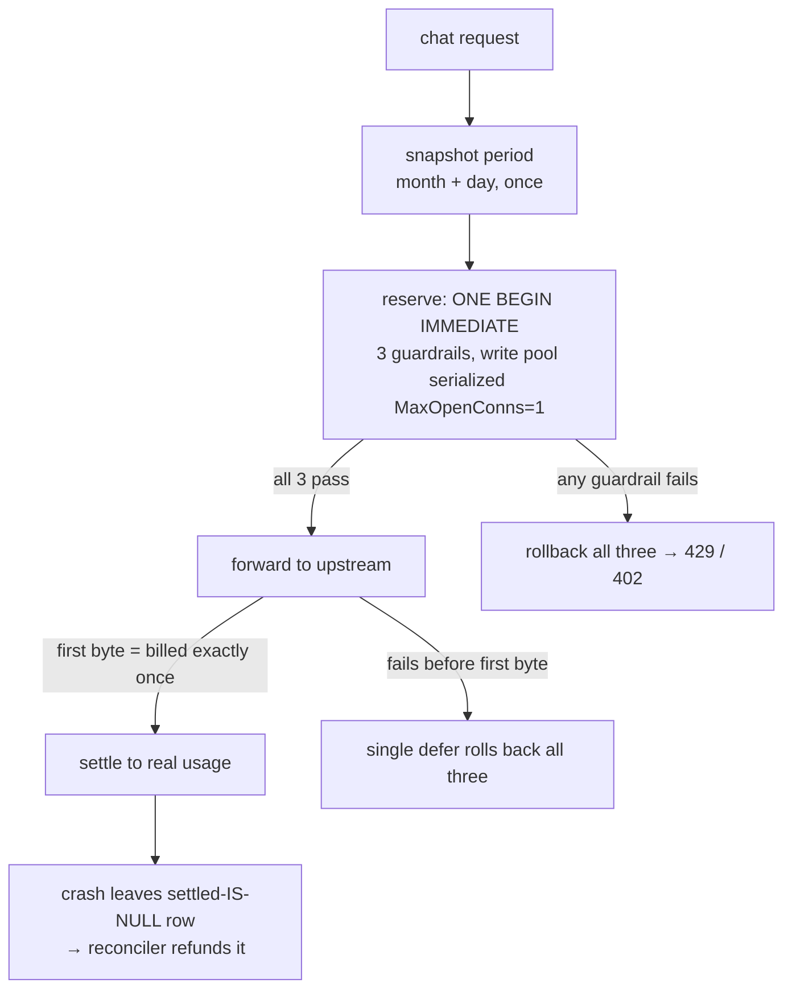
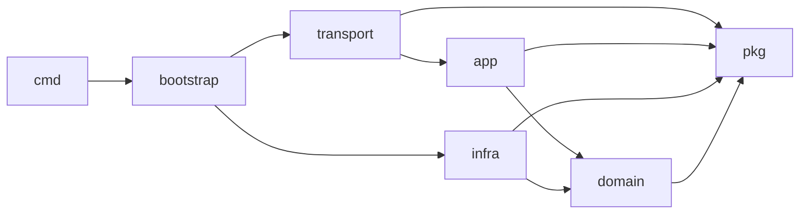

# Anselm Gateway

[English](README.md) · 简体中文

[](https://github.com/Cookiezisg/Anselm-API-Serve/actions/workflows/ci.yml)


> **永不超卖你的 LLM 预算。** 一个纯 Go + SQLite 的单二进制网关,给你的 app 一个免费、计量的 LLM 档:上游 API key 只留在服务端,而**悲观三闸预占账本**保证——崩溃只会多退、绝不超卖。

Anselm Gateway 是一层薄薄的、OpenAI 兼容的代理,挡在单个上游(DeepSeek)前面。它做三件事,每件都做到对账级别的严谨:

1. **代理推理** —— OpenAI 兼容的 `/v1/chat/completions`(流式 + 非流式 + `tools`/agentic)。上游 key 注入在请求**副本**上,绝不出服务端。
2. **悲观计量** —— 进上游前,在单个 SQLite 事务里对三道闸(月度请求数 / 单 install 日 token 上限 / 全局日预算)原子预占,再据真实用量结算。任何失败都回滚;崩溃只会多扣、绝不少扣。operator 的钱包永不超卖。
3. **反滥用** —— 匿名 install token(只存 SHA-256)+ 可选的 PoW / 限流闸(默认全部休眠)。

Clean Architecture 由 **linter 强制**(golangci-lint depguard);有一份当作验收准绳的不变量登记册、11 条不可变 ADR、覆盖四层的测试 + 真 loopback 全栈 e2e,以及带 readyz gate 自动回滚的部署。

## 永不超卖的账本



三道闸 —— `月度次数 < 配额`、`install 日 token + 估算 ≤ 上限`、`全局日预算 + 估算 ≤ 预算` —— 在**同一个** `BEGIN IMMEDIATE` 事务、单写连接池里判定,并发请求无法竞争这次读-改-写。计费只发生一次,在上游首字节。首字节**之前**的任何失败,都通过单一兜底 defer 反转全部三项预占。崩溃只会把请求**多扣**(留下一行 `settled IS NULL`,由 reconciler 退还),绝不少扣。多数 LLM 网关对这点一笔带过;这里它是核心设计。

## 架构(干净,且强制)



依赖只指向更稳定的内层,**违反即构建失败**(depguard):`domain` 零 infra import;`app` 在本包以 interface 声明所需 infra 端口;`*sql.Tx` 绝不漏出 `infra`;`bootstrap` 是唯一可跨层 import 的包——而它无人 import。三个物理隔离的监听器:公网业务面、loopback-only 运维/metrics/pprof 面、loopback 管理后台。

## 为什么值得看一眼

- **可信的记账** —— 单写 SQLite + `BEGIN IMMEDIATE`、reserve → forward → settle saga、`settled IS NULL` 单赢家 CAS 幂等、崩溃只多扣的 reconcile。
- **真正被强制的 Clean Arch** —— 依赖图是 CI 门禁,不是 wiki 上的图。
- **不变量登记册 + 11 条 ADR** —— `GW-INV-NN` 当作逐次改动的验收准绳;14 类已知 bug 按构造免疫(如断路器 DoS 放大被故障分类排除,ADR-011)。
- **单个静态二进制** —— 纯 Go(`CGO_ENABLED=0`)+ 内嵌 SQLite(WAL)+ React/Vite 后台 `go:embed` 进二进制,部署不需要 Node。
- **免费档也能 agentic** —— 透传 `tools`/`tool_choice`,多轮工具调用保留 `reasoning_content`。
- **生产级 CI/CD** —— race 测试、golangci-lint、govulncheck、fuzz smoke、SPDX SBOM、前端漂移门(重建内嵌后台并 `git diff --exit-code`)、actions 钉 40 位 SHA、readyz gate 自动回滚、systemd socket-activation 跨重启不丢连接。

## 快速开始

```sh
cp .env.example .env          # 至少填 DEEPSEEK_API_KEY
set -a; source .env; set +a   # (bash/zsh;fish 见 .env.example)
make run                      # = go run ./cmd/gateway
curl -s localhost:8080/healthz   # → {"status":"ok"}
```

端到端(领号,然后当成任意 OpenAI 兼容端点用):

```sh
TOKEN=$(curl -s -XPOST localhost:8080/v1/install | jq -r .token)

curl -s localhost:8080/v1/chat/completions \
  -H "Authorization: Bearer $TOKEN" -H 'Content-Type: application/json' \
  -d '{"model":"deepseek-chat","stream":true,
       "messages":[{"role":"user","content":"hello"}]}'

curl -s localhost:8080/v1/quota -H "Authorization: Bearer $TOKEN" | jq
```

`model` 会被强改写到 `MODEL_ALLOWLIST` 首项,客户端填任意 model 名都行;`GET /v1/models` 返回真实清单。

## 管理后台

内嵌的 React SPA —— 实时快照、配置热改、install 封禁/审计、一键 DB 导出 —— 由二进制提供,会话 + CSRF 保护(loopback,仅当 `DASHBOARD_USER`/`DASHBOARD_PASSWORD` 都配时才起)。

<!-- 把截图放到 docs/assets/dashboard.png 后取消注释: -->
<!--  -->

## API

业务面(`127.0.0.1:8080`,经 Caddy 暴露公网):

| 方法 | 路径 | 鉴权 | 说明 |
|---|---|---|---|
| `POST` | `/v1/install` | 无 | 领 install token(`{token, monthlyQuota, resetAt}`),只回显一次 |
| `POST` | `/v1/chat/completions` | Bearer token | OpenAI 兼容推理;按 `stream` 返 SSE 或 JSON |
| `GET` | `/v1/models` | Bearer token | OpenAI `{object:"list", data:[…]}`,源自实时 allowlist,只读 |
| `GET` | `/v1/quota` | Bearer token | `{limit, used, remaining, resetAt, available}` |
| `GET` | `/healthz` | 无 | 纯进程存活,不碰 DB/上游 |

运维面(`127.0.0.1:9090`,**仅 loopback**,绝不反代):`/metrics`、`/readyz`(`{db, upstream, disk}`)、`/debug/pprof/*`、`/debug/vars`。
管理后台(`127.0.0.1:8081`,loopback):`/login`、`/logout`,以及会话保护的 `/api/*`。

成功返回**裸实体**,失败返回 `{"error":{"code","message"}}`;上游 body/key 绝不透传。完整契约见 [`docs/references/backend/api.md`](docs/references/backend/api.md)。

## 配置

加载顺序 = env 默认 ← `settings` 表 DB 覆盖(运行时可改项可在后台热改)。完整面见 [`.env.example`](.env.example) 与 [`docs/references/backend/config.md`](docs/references/backend/config.md)。

机密 **env-only**,绝不入库/Dump/日志:`DEEPSEEK_API_KEY`(必填,逗号分隔多 key)、`DASHBOARD_USER`/`DASHBOARD_PASSWORD`(成对可选)、`INSTALL_POW_SECRET`(仅启用 PoW 时必填)。关键护栏:`GLOBAL_DAILY_BUDGET_TOKENS`、`INSTALL_DAILY_TOKEN_CAP`(须 ≤ 全局预算)、`MONTHLY_QUOTA`、`MAX_TOKENS_CAP` / `INPUT_TOKEN_CAP`、`N_GLOBAL_CONCURRENCY`、`RATE_PER_MIN`。反滥用闸(`INSTALL_GLOBAL_DAILY_CAP`、`TOKEN_ANOMALY_RPM`、`INSTALL_POW_MODE` 等)默认全 `0`/`off`。

## 部署

任意 VPS 上的 Caddy + systemd:

- Caddy 终结 TLS 并反代 `<你的域名> → 127.0.0.1:8080`(SSE 即时下发);Go 进程只绑 `127.0.0.1`,绝不直面公网。
- systemd socket-activation 持有 `:8080` 的 fd,连接跨重启不丢。
- GitHub Actions(push `main`):`vet + test -race` → 静态 `linux/amd64` 编译 → 版本化二进制 + 原子 symlink → 部署 gate(本机 `readyz`/`healthz`,失败自动回滚上一版)→ 仅留最近 5 版。

部署目标(域名、ACME 邮箱)经 GitHub secret 注入、不入库。见 [`.github/workflows/deploy.yml`](.github/workflows/deploy.yml) 与 [`deploy/`](deploy/)。

## 开发

```sh
make verify    # vet + build + test -race + docs(本地门禁)
make lint      # golangci-lint v2.6.1(含 depguard 分层门)
make docs      # 文档治理门禁
```

测试覆盖四层(约 48 个 `_test.go`)+ loopback 全栈 e2e(`internal/e2e`,`integration` tag);CI 强制钱路覆盖地板(`app/quota` ≥ 70%、`app/chat` ≥ 65%),并跑 govulncheck、gofmt、fuzz smoke、SBOM、前端漂移门。

## 项目状态与范围

线上 `main` 运行中;管理后台 SPA 已接线并提供;单轮与多轮 agentic 已端到端验证。

这是一个**刻意做薄**的网关:单上游(DeepSeek)、单 operator 预算、单节点 SQLite + 单写池(原子记账的地基,而非待办)。它为一个产品而建,但其中的模式 —— 永不超卖的预占账本、被强制的 Clean Arch 依赖图 —— 是设计成可以搬进你自己的网关的。它不是多租户 LLM 路由、不是计费系统、也不横向扩展;运维面按设计 loopback-only。

## 文档

`docs/` 是受治理的文档体系,入口是 [`docs/INDEX.md`](docs/INDEX.md):

- [`concepts/architecture.md`](docs/concepts/architecture.md) —— 系统心智模型
- [`references/backend/`](docs/references/backend/) —— 逐字契约(api / config / database / error-codes / invariants)
- [`decisions/`](docs/decisions/) —— ADR-001..011(不可变取舍记录)

## 许可

[MIT](LICENSE)。
